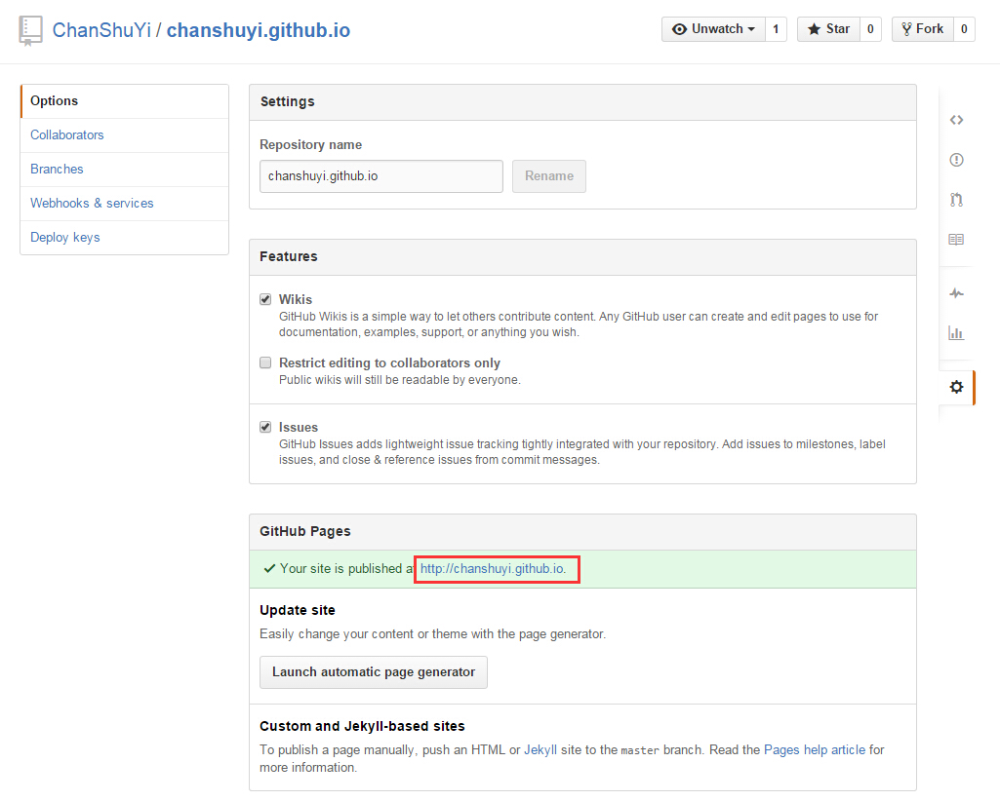

# 用Github创建你的个人站点

用Github作为个人的静态站点访问有两种方式：

- 第一种是直接创建特定名称的仓库
- 第二种是在仓库内创建特定名称的分支

首先，你需要一个Github帐号，点击这里可以[注册](https://www.github.com/)。

## 直接创建特定名称的仓库

用这种方式创建的站点，一个用户只能创建一个，所以一般用来作为用户的个人站点。

首先，创建一个仓库，名字格式为：`account_name.github.io`。其中`account_name`表示你的Github账户名，这是特定格式，不能随便修改的哦。

例如我的账户名是：`chanshuyi`，那么我填的仓库名就是：`chanshuyi.github.io`。

创建完成之后到仓库的主页面，点击右边的Settings选项，拉到最下面可以看到站点的访问地址。



之后把你的站点上传到这个仓库就可以了。

## 在仓库内创建特定名称的分支

这种方式创建的站点数不受限制，因此一般用来作为仓库的一些demo展示。

### 创建`gh-pages`分支

首先，你需要有一个已经创建好的仓库，然后直接添加一个名为`gh-pages`的分支。

```git
//通过命令创建
git checkout -b gh-pages
git push -u origin gh-pages
```

有了这个分支，Github会自动为你分配一个访问网址：`http://USERNAME.github.io/REPONAME`。

### 创建本地对应分支

因为我们创建了多个分支，为了避免文件上的混乱，我们在另外一个文件夹将`gh-pages`分支下载下来。

```git
git clone -b gh-pages git@github.com:USERNAME/REPONAME.git REPONAME_gitbook
```

完成之后将html内容复制到`REPONAME_gitbook`文件夹中，并推送到服务器就可以了。

## 绑定域名

如果你不想用http://username.github.com/jekyll_demo/这个域名，可以换成自己的域名。具体方法是在 repo 的根目录下面，新建一个名为 CNAME 的文本文件，里面写入你要绑定的域名，比如 example.com 或者 xxx.example.com。如果绑定的是顶级域名，则 DNS 要新建一条A记录，指向 204.232.175.78。如果绑定的是二级域名，则 DNS 要新建一条 CNAME 记录，指向 username.github.com（请将 username 换成你的用户名）。此外，别忘了将_config.yml 文件中的 baseurl 改成根目录"/"。


第一种方式因为对仓库名称做了限定，而Github的仓库名称又是不能重复的，所以只能创建一个，而第二种方式能在每个仓库里都创建一个可访问的站点。而第一种方式的好处就是直接用`github_account.github.io`就可以访问，而第二种方式创建的站点要用`github_account.github.io/repo_name`才能访问，即多了一级目录（但其实这个可以通过域名定向来访问）。


相关资料：   
- [Git Pages](https://pages.github.com/)
- [Git Pages Help](https://help.github.com/categories/github-pages-basics/)

参考资料：   
- [http://www.linuxidc.com/Linux/2015-02/114121.htm](http://www.linuxidc.com/Linux/2015-02/114121.htm)   
- [http://www.linuxidc.com/Linux/2015-02/114121p2.htm](http://www.linuxidc.com/Linux/2015-02/114121p2.htm)

