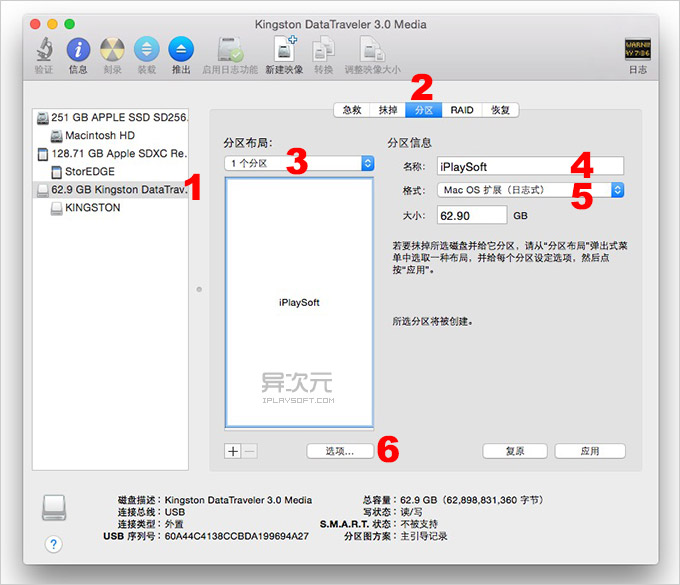
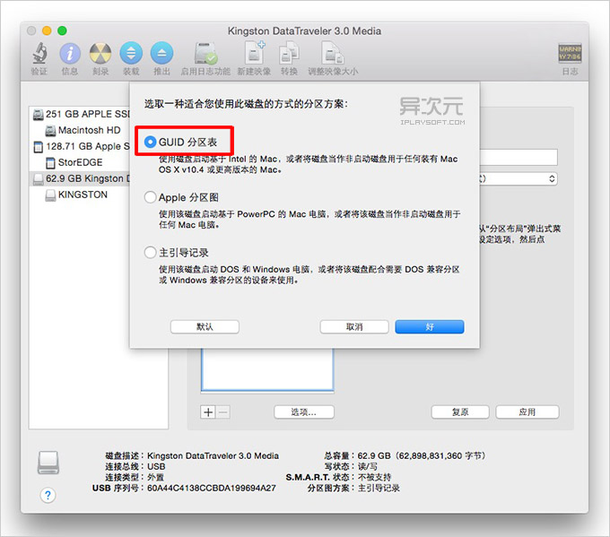
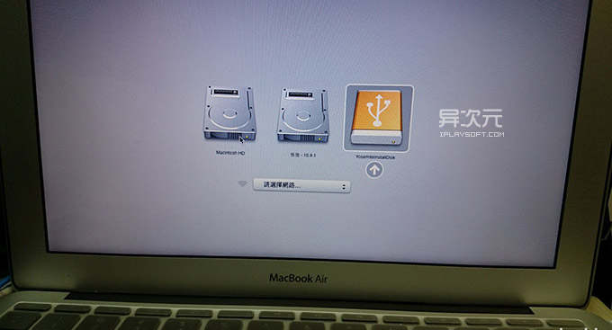

# 制作OSX启动盘

其实制作 OS X Yosemite 正式版 USB 启动盘的方法有很多，譬如使用命令行的，也有使用第三方工具的。这个教程主要介绍前者，因为这是目前我了解到的最稳妥、简单，而且没有兼容性问题的方法了。这种方式虽然耗时，但是绝对是可以成功的！

## 准备工作

- 准备一个 8GB 或以上容量的 U 盘，确保里面的数据已经妥善备份好（该过程会抹掉 U 盘全部数据）。
- 从Apple Store下载苹果官方 OS X Yosemite 正式版的安装程序。如果自己没有Mac的，你可以去网盘下载，但是有可能你下载的是错误的，到最后也不能成功。
- 如果你是从 Mac AppStore 下载的，下载完成后安装程序可能自动开始，这时先退出安装。如从网盘下载的，请将解压后获得的 "Install OS X Yosemite.app" (显示为 "安装 OS X Yosemite.app") 移动到「应用程序」文件夹里面。

## 格式化U盘

插入你的 U 盘，然后在「应用程序」->「实用工具」里面找到并打开「磁盘工具」，或者直接用 Spotlight 搜索 “磁盘工具” 打开，如下图。



- 在左方列表中找到 U 盘的名称并点击
- 右边顶部选择 2 -「分区」，然后在 3 -「分区布局」选择「1个分区」
- 在分区信息中的 4 -「名称」输入「iPlaySoft」 (由于后面的命令中会用到此名称，如果你要修改成其他(英文)，请务必对应修改后面的命令)
- 在「格式」中选择 5 -「Mac OS 扩展 (日志式)」这时，先别急着点“应用”，还要先在 6 -「选项」里面，如下图。



选择「GUID 分区表」，然后点击「好」。最后再点「应用」开始对 U 盘进行格式化。

## 输入终端命令开始制作启动盘

- 请再次确保名为 “安装 OS X Yosemite” 的文件是保存在「应用程序」的目录中
- 在「应用程序」->「实用工具」里面找到「终端」并打开。也可以直接通过 Spotlight 搜索「终端」打开
- 复制下面的命令，并粘贴到「终端」里，按回车运行：

```bash
sudo /Applications/Install\ OS\ X\ Yosemite.app/Contents/Resources/createinstallmedia --volume /Volumes/iPlaySoft --applicationpath /Applications/Install\ OS\ X\ Yosemite.app --nointeraction
```

回车后，系统会提示你输入管理员密码，接下来就是等待系统开始制作启动盘了。这时，命令执行中你会陆续看到类似以下的信息：

```bash
Erasing Disk: 0%... 10%... 20%... 30%...100%...
Copying installer files to disk...
Copy complete.
Making disk bootable...
Copying boot files...
Copy complete.
Done.
```

当你看到最后有 「Copy complete」和「Done」 字样出现就是表示启动盘已经制作完成了！

## U 盘启动安装 OS X Yosemite 的方法

当你插入制作完成的 OS X Yosemite U盘启动盘之后，桌面出现「Install OS X Yosemite」的盘符那么就表示启动盘是正常的了。那么怎样通过 USB 启动进行全新的系统安装呢？

其实很简单，先在目标电脑上插上 U 盘，然后重启你的 Mac，然后一直按住「option」(alt) 按键不放，直到屏幕显示多出一个 USB 启动盘的选项，如下图。



这时选择 U 盘的图标回车，即可通过 U 盘来安装 Yosemite 了！这时，你可以直接覆盖安装系统(升级)，也可以在磁盘工具里面格式化抹掉整个硬盘，或者重新分区等实现全新的干净的安装。


参考资料：

- [http://www.iplaysoft.com/osx-yosemite-usb-install-drive.html](http://www.iplaysoft.com/osx-yosemite-usb-install-drive.html)
- [http://www.macx.cn/thread-2143641-1-1.html](http://www.macx.cn/thread-2143641-1-1.html)