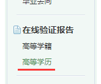
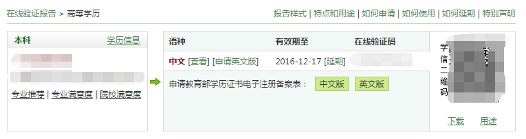

# 深圳公租房申请指南

>主管政府机关：[深圳市住房和建设局](http://www.szjs.gov.cn/)   
>相关文件：[公共租赁住房轮候申请](http://www.szjs.gov.cn/bsfw/bszn/smbs/201311/t20131122_2252312.htm)   

## 所需资料

每个人情况不同，所需要的资料页不同，请点击[这里](http://www.szjs.gov.cn/bsfw/bszn/smbs/201311/t20131122_2252312.htm)查阅自己所需资料。

例如小树是全日制本科毕业，但社保仅有14个月，未婚，深圳户口，一个申请，未获得任何购房补贴，查询[公共租赁住房轮候申请](http://www.szjs.gov.cn/bsfw/bszn/smbs/201311/t20131122_2252312.htm)资料后可知需要以下资料：

- 《深圳市保障性住房轮候申请表（公共租赁住房）》
- 身份证原件及其复印件
- 户口本及其复印件
- 学信网上的学历证明

NOTE：

- 现在申请公租房不需要未婚证明，如果资料中提及，请忽略即可。
- 资料中提及户口本的，只是你本人的户口卡而已，不需要户口首页。

## 相关链接

**社保缴纳查询**

登陆[社会保险服务个人网页](https://e.szsi.gov.cn/siservice/LoginAction.do)，点击社保查询，自己计算缴交的月份数。

NOTE：建议用IE浏览器登陆，否则会出现兼容问题。

**学信网-学历注册备案表**

首先点击[这里](http://my.chsi.com.cn/)登陆个人学信网账号，登陆之后点击左边“在线验证报告”->“高等学历”。

如果你之前没申请过，那么应该要点击“申请教育部学历证书点子注册备案表”。如果你已经申请过了，那么右边应该会有一条记录。

此时如果备案表还有效，那么可以直接点击查看，之后直接打印保存为pdf文件。否则，你需要点击延期之后再进行查看、打印操作。
